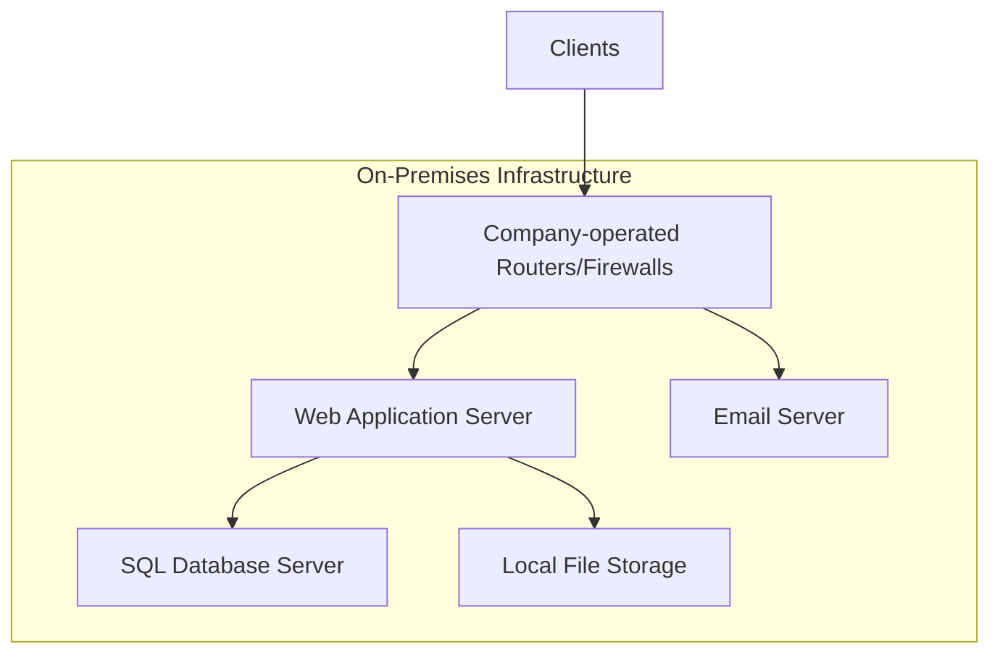
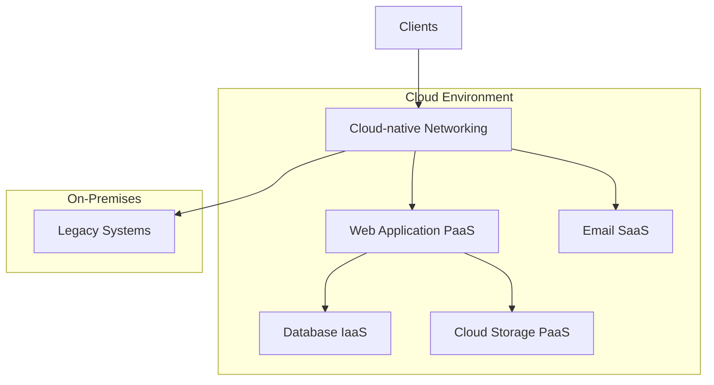

# Lab
## Cloud Migration Plan

## Current On-Premises Architecture

Our current on-premises solution consists of the following components:

1. Web Application (Monolithic): Hosted on physical servers
2. Backend Database: SQL server
3. File Storage: Local file system
4. Networking: Company-operated routers and firewalls
5. Email Services: For client notifications

## Migration Strategy

### Web Application
- **Target: PaaS**
- **Reasoning**: PaaS provides a managed environment for web applications, reducing operational overhead and improving scalability.
- **Steps**:
  1. Assess application for cloud readiness
  2. Refactor application if necessary for cloud compatibility
  3. Choose appropriate PaaS offering (e.g., Azure App Service, AWS Elastic Beanstalk)
  4. Deploy and test in cloud environment
  5. Migrate traffic gradually to cloud-hosted application

### Database
- **Target: PaaS (with initial IaaS consideration)**
- **Reasoning**: PaaS offerings for databases provide managed services with automatic scaling and backups. However, an initial IaaS approach might be considered for minimal changes.
- **Steps**:
  1. Assess current database size and performance requirements
  2. Choose between immediate PaaS migration or initial IaaS approach
  3. If PaaS: Select appropriate service (e.g., Azure SQL Database, Amazon RDS)
  4. If IaaS: Provision virtual machines and install database software
  5. Plan and execute data migration
  6. Update application connection strings
  7. Validate data integrity and performance

### File Storage
- **Target: PaaS**
- **Reasoning**: Cloud storage services offer scalability, durability, and integration with other cloud services.
- **Steps**:
  1. Inventory current file storage usage and access patterns
  2. Select appropriate cloud storage service (e.g., Azure Blob Storage, Amazon S3)
  3. Develop migration plan (consider using migration tools provided by cloud vendors)
  4. Execute file transfer
  5. Update application to use cloud storage APIs
  6. Validate access and performance

### Networking
- **Target: Cloud-native networking**
- **Reasoning**: Leveraging cloud-native networking services provides better integration with other cloud resources and improved manageability.
- **Steps**:
  1. Design cloud network architecture (VPCs, subnets, etc.)
  2. Set up VPN or Direct Connect for hybrid connectivity
  3. Configure cloud-native firewalls and security groups
  4. Implement network monitoring and logging
  5. Gradually transition traffic to cloud network

### Email Services
- **Target: SaaS**
- **Reasoning**: Email is a standard service that can be easily migrated to a SaaS solution, reducing maintenance and improving reliability.
- **Steps**:
  1. Select appropriate email SaaS provider (e.g., Microsoft 365, Google Workspace)
  2. Plan user and data migration
  3. Update DNS records
  4. Migrate user data and configure client applications
  5. Update application to use new email service APIs for notifications

## Hybrid Approach Consideration

Initially, we will adopt a hybrid approach to minimize risk and allow for a smoother transition:

1. Migrate the web application to PaaS for improved scalability and reduced management overhead.
2. Keep the database on IaaS initially to minimize changes and allow for a more controlled migration.
3. Move file storage to cloud PaaS services for better integration and scalability.
4. Implement cloud-native networking while maintaining a secure connection to on-premises resources.
5. Migrate email to a SaaS solution for immediate benefits in management and reliability.

This hybrid approach allows us to:
- Quickly gain benefits from cloud services where it's most impactful (web app, storage, email)
- Minimize initial changes to critical systems (database)
- Maintain connectivity with any systems that must remain on-premises temporarily

As the migration progresses and we gain more experience with cloud operations, we can consider moving the database to a PaaS solution and migrating any remaining on-premises systems to fully realize the benefits of cloud computing.
