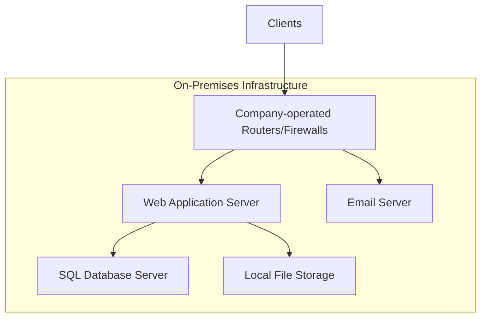
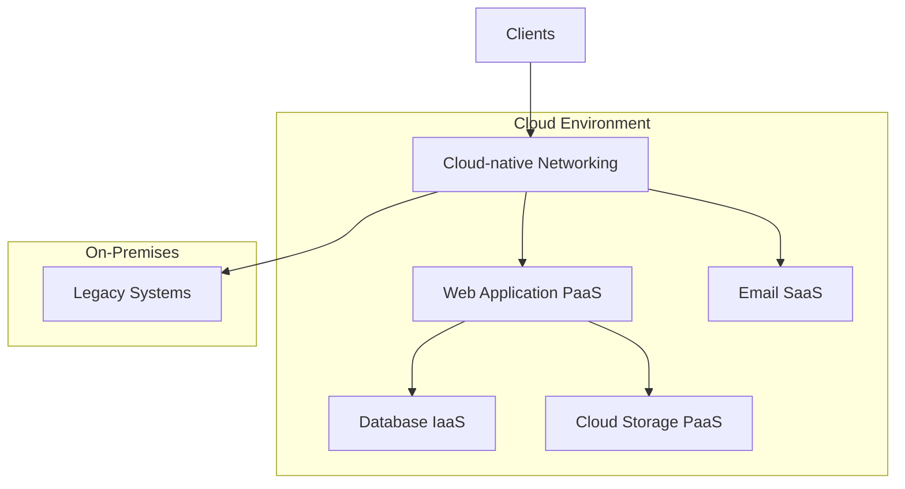

# Lab 3
## Cloud Migration Plan

## Current On-Premises Architecture

Our current on-premises solution consists of the following components:

1. Web Application: We have a single web application that runs on our physical servers. It combines everything in one place, which makes it hard to scale or update quickly.

2. Database: Our data is managed using SQL Server. It’s reliable for keeping our information organized, but it can slow down as we add more data.

3. File Storage: We store files directly on our server’s hard drives. This is straightforward, but it limits how much we can store and makes backups a bit tricky.

4. Networking: Our network runs on routers and firewalls that we manage ourselves. This gives us control but requires skilled staff to keep everything secure and running smoothly.

5. Email Services: We use email to notify our clients about updates. It helps us communicate, but we have to manage spam and make sure we’re following the rules about email privacy.

## Migration Strategy

### Web Application
- **Target: PaaS**
- **Reasoning**: There are numerous advantages to moving your online application from a monolithic structure to a PaaS architecture, such as Microsoft Azure. For instance, Azure App Service makes it simple to scale your application to accommodate more users without requiring you to make all of the changes at once. 
- **Steps**:
  1. Assess application for cloud readiness
  2. Refactor application if necessary for cloud compatibility
  3. Choose appropriate PaaS offering (e.g., Azure App Service, AWS Elastic Beanstalk)
  4. Deploy and test in cloud environment
  5. Migrate traffic gradually to cloud-hosted application

### Database
- **Target: PaaS (with initial IaaS consideration)**
- **Reasoning**: Starting with Infrastructure as a Service (IaaS), you may operate your own database servers in the cloud with complete control over setup and management by utilizing Azure Virtual Machines. You can move to a Platform as a Service (PaaS) solution, such as Azure SQL Database, as your needs change. Because Azure handles scaling, backups, and security, this shift streamlines operations. Making a gradual switch from IaaS to PaaS will allow you to concentrate more on application development and less on database management, which will improve setup efficiency and reduce costs.

- **Steps**:
  1. Assess current database size and performance requirements
  2. Choose between immediate PaaS migration or initial IaaS approach
  3. If PaaS: Select appropriate service (e.g., Azure SQL Database, Amazon RDS)
  4. If IaaS: Provision virtual machines and install database software
  5. Plan and execute data migration
  6. Update application connection strings
  7. Validate data integrity and performance

### File Storage
- **Target: PaaS**
- **Reasoning**: Cloud storage services are more scalable, durability, and eaier to integrate with other cloud services. We can be more flexible if it needs another expansion. It can also cost way less for further expansion, if any is neeeded. 
- **Steps**:
  1. Inventory current file storage usage and access patterns
  2. Select appropriate cloud storage service (e.g., Azure Blob Storage, Amazon S3)
  3. Develop migration plan (consider using migration tools provided by cloud vendors)
  4. Execute file transfer
  5. Update application to use cloud storage APIs
  6. Validate access and performance

### Networking
- **Target: Cloud-native networking**
- **Reasoning**: IF we can Leverage the cloud-native networking services then we can have better integration with other cloud resources and it will aslo improve manageability.
- **Steps**:
  1. Design cloud network architecture (VPCs, subnets, etc.)
  2. Set up VPN or Direct Connect for hybrid connectivity
  3. Configure cloud-native firewalls and security groups
  4. Implement network monitoring and logging
  5. Gradually transition traffic to cloud network

### Email Services
- **Target: SaaS**
- **Reasoning**: Email is a standard service that is easy to migrated to a SaaS solution, reducing maintenance and improving reliability. The uptime can aslo be significantly improved by this as traditional in house mail services are not relaiant.
- **Steps**:
  1. Select appropriate email SaaS provider (e.g., Microsoft 365, Google Workspace)
  2. Plan user and data migration
  3. Update DNS records
  4. Migrate user data and configure client applications
  5. Update application to use new email service APIs for notifications

## Hybrid Approach Consideration

Initially, we will adopt a hybrid approach to minimize risk and allow for a smoother transition:

1. Migrate the web application to PaaS for improved scalability and reduced management overhead.
2. Keep the database on IaaS initially to minimize changes and allow for a more controlled migration.
3. Move file storage to cloud PaaS services for better integration and scalability.
4. Implement cloud-native networking while maintaining a secure connection to on-premises resources.
5. Migrate email to a SaaS solution for immediate benefits in management and reliability.

This hybrid approach allows us to:
- Quickly gain benefits from cloud services where it's most impactful (web app, storage, email)
- Minimize initial changes to critical systems (database)
- Maintain connectivity with any systems that must remain on-premises temporarily

As the migration progresses and we gain more experience with cloud operations, we can consider moving the database to a PaaS solution and migrating any remaining on-premises systems to fully realize the benefits of cloud computing.
