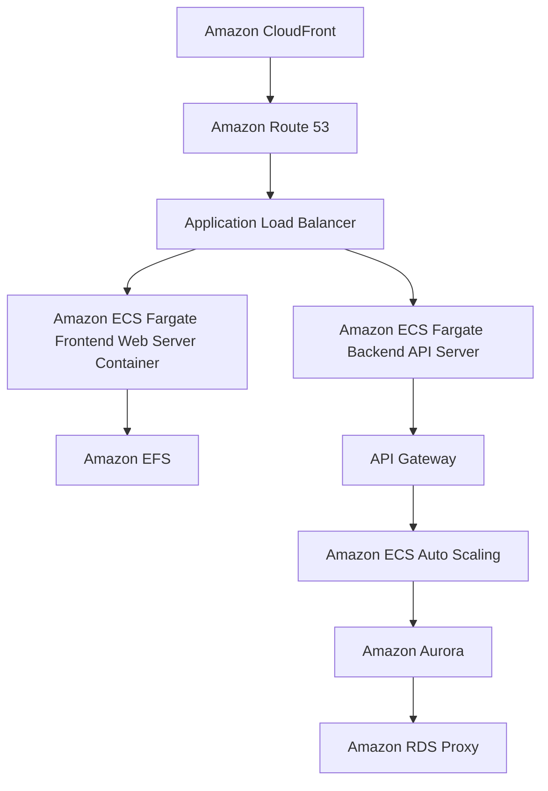

# Lab Report: Rehosting a 3-Tier eCommerce Application to AWS

## Objective
To migrate a 3-tier eCommerce app from an on-premises environment to AWS using a "lift and shift" approach. The application consists of:
- **Frontend Web Server**: WebAppVM running on Apache or Nginx
- **Backend API Server**: APIVM running on Node.js, Java, or .NET
- **SQL Database**: DBVM hosting MySQL, PostgreSQL, or Microsoft SQL Server

### Requirements
- Implement load balancing for the frontend web server.
- Enable auto-scaling for backend API and database tiers.
- Ensure data consistency across the application.
- Downtime must not exceed 2 hours.

---

## Cloud-Native Architecture

### Architecture Diagram

### AWS Services Used
- **Amazon CloudFront**: It is a global content delivery network (CDN) that stores and distributes static content from edge locations, such as images and CSS. It is positioned ahead of Amazon Route 53 to improve performance and lower latency by delivering content closer to users. CloudFront reduces stress on Amazon ECS Fargate by outsourcing the delivery of static content, resulting in quicker page loads and better scalability.
- **Amazon Elastic Container Service (ECS)**: We can deploy and containerize the Frontend and Backend services  using Amazon ECS with Fargate, which will remove the need for managing EC2 instances.
- **Amazon API Gateway**: Can be used to handle traffic for the backend API services which will provide a fully managed and scalable API management solution.
- **Amazon Aurora**: It is a fully managed relational database service that is compatible with MySQL/PostgreSQL, offering higher performance and availability with automatic multi-AZ failover.
- **Amazon Elastic File System (EFS)**: It is a scalable, shared file storage system which is used to store shared assets across containers running in ECS, such as static web files.

---

## Key Features of the Architecture

### Scalability
- **Amazon ECS** with **AWS Fargate** allows containerized workloads for both frontend and backend tiers to scale independently without managing servers.
- **Amazon API Gateway** provides scalable, serverless API access for the backend which ensures that high volumes of traffic are handled dynamically.

### Availability
- **Amazon Aurora** provides high availability with Multi-AZ deployments, ensuring that the SQL database remains operational in the event of a failure in one availability zone.
- **Elastic File System (EFS)** guarantees that resources or information shared amongst containers can be accessed from various availability zones.

### Disaster Recovery
- **Aurora’s automated backups** and snapshots, combined with **Multi-AZ** replication guarantees the high availability of the database and enables quick restoration in the event of a failure.
- **ECS Fargate** eliminates the possibility of hardware failure because AWS fully manages the underlying infrastructure.

---

## Migration Process

### Step 1: Rehost and Containerize the Application
- **Frontend and Backend Containers**: Utilize Docker to containerize the frontend web server and backend API server, then deploy these containers using **Amazon ECS** with **Fargate**.
- **Amazon EFS**: Configure EFS for the frontend container to store shared assets such as static web files.

### Step 2: Set Up Data Infrastructure
- Migrate the on-premise SQL database to **Amazon Aurora**. Aurora's high performance and Multi-AZ capabilities make it ideal for managing SQL data at scale.
- Use **AWS Database Migration Service (DMS)** to replicate the on-premise database to Aurora.

### Step 3: Enable Load Balancing and Auto-Scaling
- **Amazon API Gateway**: Configure API Gateway to route requests to the backend API containers deployed in ECS. API Gateway automatically scales to handle incoming requests.
- **ECS Auto Scaling**: Set up auto-scaling policies to dynamically scale the frontend and backend containers in response to traffic.

### Step 4: Data Migration and Cutover
- Use **AWS DMS** to continuously replicate the SQL database to **Aurora** until cutover.
- Ensure data consistency by enabling ongoing replication before the final cutover.

### Step 5: Testing and Rollback
- Perform testing within the AWS environment to ensure that containers are communicating with Aurora correctly.
- Implement a rollback plan: If issues arise, revert the DNS settings to the on-premise infrastructure, while maintaining the replicated Aurora database for failback.

---

## Q&A Section

### Q1: Major AWS Services and Roles
- **Amazon ECS with Fargate**: Used for running the frontend and backend services in a containerized environment, without managing servers.
- **Amazon API Gateway**: Provides API management for backend services, automatically scaling to handle increasing loads.
- **Amazon Aurora**: A high-performance managed database solution with multi-AZ failover for high availability.
- **Amazon Elastic File System (EFS)**: Provides scalable shared file storage for the frontend containers to access static files.

### Q2: Ensuring Minimal Downtime
- **AWS Database Migration Service (DMS)** keeps the SQL database continuously replicated to Aurora, guaranteeing that the data is up to date and prepared for the final cutover with the least amount of downtime.

- Using **ECS Fargate** for containers allows a rapid deployment of both frontend and backend services, reducing setup time and overall downtime to under 2 hours.

### Q3: Data Consistency Strategy
- Continuous data replication using **AWS DMS** ensures that the SQL database is synchronized between the on-premise environment and Aurora until final migration.
- **Amazon Aurora’s Multi-AZ** replication ensures that the data is consistent and will be highly available across multiple availability zones.

---

## Conclusion
By using AWS services such as **Amazon ECS**, **API Gateway**, **Aurora**, and **EFS**, the migration of the 3-tier eCommerce application provides improved scalability, high availability, and data consistency. Using **AWS Fargate** for containerized workloads eliminates the need to manage infrastructure, allowing for an efficient and flexible migration process while meeting the requirement of minimal downtime.
