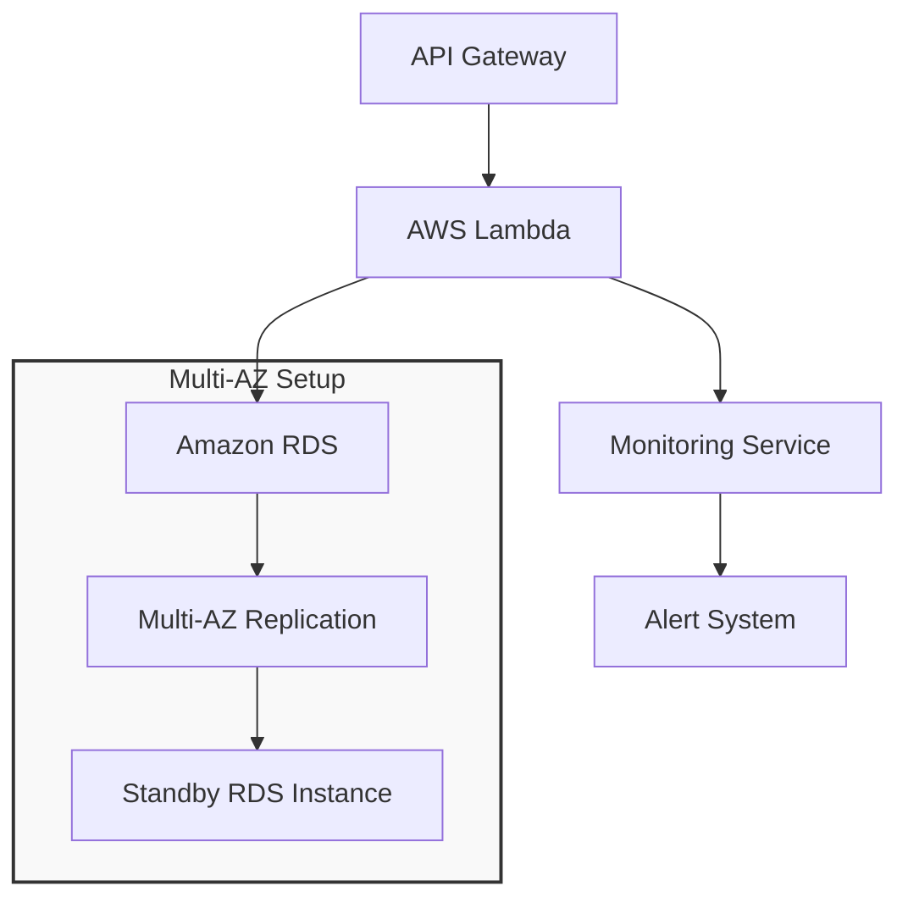

# High-Level Design (HLD) Document for Lift-and-Shift Migration

## Target Architecture Diagram

                                        
*The new architecture is depicted in the following diagram, which uses Amazon RDS with multi-AZ replication for the database and AWS Lambda for serverless operations.*

## Description of the Target Architecture

The new architecture will replace the virtual machines (WebServerVM and SQLVM) with serverless technology. The main features include:

1. **AWS lambda for Compute**: AWS Lambda, which controls application scaling automatically, will power the API-based application. It can therefore support a large number of users without requiring any physical labor.
   
2. **Amazon RDS with Multi-AZ Replication**: We are going to migrate the MySQL database over to Amazon RDS. A backup database is ready to take over in the event that the primary database fails thanks to multi-AZ replication. This configuration aids in maintaining database availability even in the event of failures.

3. **Benefits**:
   - **Reduced Downtime**: The serverless architecture minimizes downtime during the move by enabling rapid updates and modifications.
   - **Scalability**: AWS Lambda scales automatically to meet traffic demands, so the application can grow without any extra effort.
   - **Cost Savings**: With serverless functions, you only pay for the computing time you need, making it more cost-effective than keeping servers that may lie idle.
## Migration Steps

### Step 1: Refactor the Application to Use Serverless Functions
1. Examine and divide the WebServerVM-hosted API application into manageable tasks.
2. For every task, create an AWS Lambda function and make sure it can handle requests on its own.
3. Configure Amazon API Gateway so that users can readily access the Lambda functions by connecting them to the internet.
### Step 2: Migrate the Database to Amazon RDS with Multi-AZ Replication
1. We have to launch a new Amazon RDS instance with MySQL as the database engine.
2. The next step would be to enable multi-AZ deployment for the RDS instance to have a backup ready in another zone.
3. Use AWS Database Migration Service (DMS) to transfer data from SQLVM to the RDS instance without causing downtime.

### Step 3: Configure Failover and Redundancy for Minimal Downtime
1. Set up monitoring tools to keep track of AWS Lambda functions and the RDS instance health.
2. For DNS failover, use Amazon Route 53, which instantly reroutes traffic in the event that a component of the service fails.
3. Test the failover system on a regular basis to make sure it functions properly and that recovery can occur during the six hours of permitted downtime.

## Conclusion

This high-level architecture describes how to successfully migrate the application to the cloud. We can increase the application's performance, dependability, and cost-efficiency while minimizing downtime during the move by utilizing AWS Lambda and Amazon RDS with multi-AZ replication.
