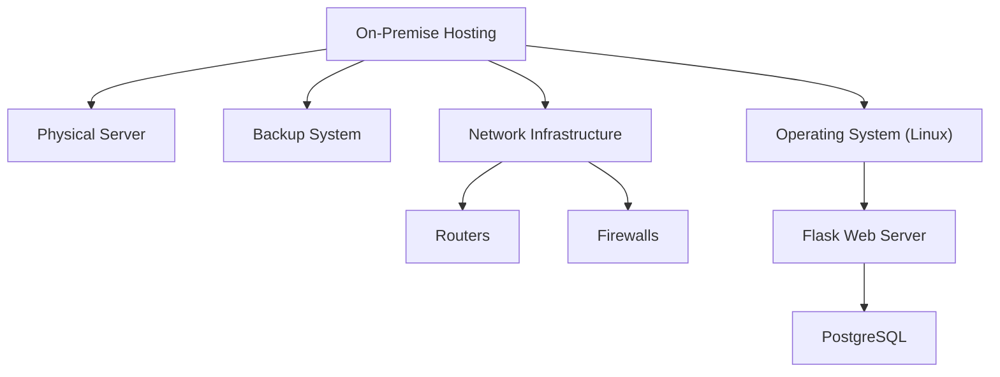
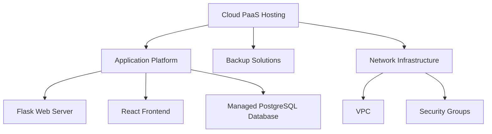

 # Lab
## On-Premises Architecture Overview



## Architecture Components
On-premise hosting of this program makes use of a physical server running Linux that also handles a number of software components. This configuration includes a network architecture with routers and firewalls to provide secure connection, as well as a backup system for data integrity and disaster recovery. The React frontend sends HTTP queries to the Flask web server, which then communicates with the PostgreSQL database to store all application data. 

 ## IaaS Architecture Overview

  ``` mermaid
    graph TD;
    A[Cloud IaaS Hosting] --> B[Virtual Machines]
    A --> C[Backup Solutions]
    A --> D[Network Infrastructure]
    D --> E[VPC]
    D --> F[Security Groups]
    D --> G[VNet]
    B --> H["Operating System (Linux)"]
    H --> I[Flask Web Server]
    H --> J[React Frontend]
    B --> K[PostgreSQL Database]
```
## How we deployed the application in cloud using IaaS:
The complete application had to be moved to the cloud in order to transition from on-premise hosting to IaaS. In order to easily increase resources, we took the actual server and transformed it into Virtual Machines (VMs) on the cloud. On these virtual machines (VMs), we installed the PostgreSQL database, Flask web server, React frontend, and Linux operating system. To ensure secure communication, a Virtual Private Cloud (VPC) was established, and security groups were added to manage access. In order to safeguard data, we also put backup plans into place. The team was able to concentrate on developing the program rather than worrying about hardware because of this change, which also made the application more manageable and versatile.

## Description of the architecture:
1. Cloud IaaS hosting: This model of hosting refers to the cloud infrastructure that hosts the complete application and offers on-demand resources such as networking, storage, and processing power. While the cloud provider oversees the management of the underlying physical resources, users retain authority over the virtualized hardware.
2. Virtual Machines (VMs): These are cloud-based virtualized instances that enable the deployment of different software environments. Based on the requirements of the application, each VM can be separately configured and scaled.
3. Network Infrastructure:Everything that makes it possible for resources in a cloud environment to communicate with one another is referred to as network infrastructure. It guarantees effective and safe data transit both inside and outside of the cloud.
4. VPC (Virtual Private Cloud):Virtual Private Clouds, or VPCs, let you create your own virtual network in a logically isolated area of the cloud. It permits management of subnets, routing, and IP address ranges.
5. Virtual Network (VNet): Similar to a Virtual Private Cloud, a VNet provides resource connectivity within a secure, isolated network environment. It makes it possible for us to allocate and arrange resources more skillfully, guaranteeing secure communication between various parts of our application. Setting up a VNet enables us to divide our resources according to functionality in our cloud migration with IaaS, such as severing the web server from the database for improved security. We can create precise access controls and routing policies that are suited to the requirements of our application thanks to this segmentation, which also reduces exposure to possible threats and streamlines network management.
6. Flask Web Server:This server runs business logic, processes HTTP requests from clients, and returns responses in addition to hosting the Flask application. It interfaces with the database and frontend as the application's backend.
7. Operating System (Linux):Operating system (Linux): Serving as the application's base, Linux controls hardware resources and offers a platform on which other software components can execute. Because of its performance, security, and stability, it is preferred OS of choice.

## How we deployed the application in cloud using PaaS
Moving the application to a cloud platform that handles most of the underlying infrastructure management for us was part of the transition from on-premise hosting to PaaS. We relocated the PostgreSQL database, React frontend, and Flask web server to a PaaS environment, which manages scaling and deployment automatically. To protect data, backup methods were incorporated, and a Virtual Private Cloud (VPC) was set up for safe networking. Users that wish to restrict who can access the program can create security groups. This shift made administration easier, freeing the team to focus on creating and refining the product instead of troubleshooting hardware and infrastructure.
## Description of the architecture
1. Cloud PaaS hosting: This gives developers the ability to concentrate on writing code rather than managing infrastructure by offering a controlled environment for application deployment. It makes maintenance, upgrades, and scalability easier, allowing the team to focus on developing and refining the application instead of managing these chores.
2. Platform for Applications: Runtime environments, development tools, and services for application deployment are at the core of the PaaS offering. In our scenario, the platform takes care of the Flask web server and React frontend automatically, guaranteeing seamless operation without the need for manual server setup or maintenance. We can expedite development and deployment by integrating crucial development tools like version control, continuous integration and delivery (CI/CD) pipelines, and debugging. The application maintains responsiveness under different loads due to integrated load balancing, and the platform's auto-scaling adapts resources based on traffic. It also offers automated security fixes and real-time monitoring, freeing up our staff to concentrate only on enhancing the application while delegating operational responsibilities.
3. Backup Solutions: Backup solutions are fully managed using PaaS, which automates the process of backing up configurations and application data. This eliminates the need for manual intervention and guarantees frequent snapshots and prompt recovery in the event of data loss or system failure.
4. Network Infrastructure: The cloud provider manages the network infrastructure in PaaS. It abstracts much of the complexity involved in configuring and maintaining network connectivity while guaranteeing secure communication between all application components.
5. Virtual Private Clouds: It lets us set up a logically separated network inside the cloud to make sure our application operates safely. While the platform controls the underlying infrastructure, it gives the authority to create IP ranges, subnets, and route tables.
6. Flask Web Server: In PaaS, a managed environment is used to deploy the Flask Web Server. Our web server can operate effectively since the cloud platform takes care of runtime, scaling, and server management, freeing us from having to handle the underlying infrastructure.
7. React Frontend: The PaaS provider also hosts and maintains the React Frontend. It works in unison with the PostgreSQL database and Flask server on the backend, and the platform guarantees scalability and performance by dynamically allocating resources in response to variations in traffic.
8. Managed PostgreSQL Database: The PaaS provider offers Managed PostgreSQL Databases as a service, taking care of database setup, scalability, backups, and upgrades. As a result, the development team is relieved of the burden of database management, guaranteeing dependable performance and high availability without the need for human maintenance.
