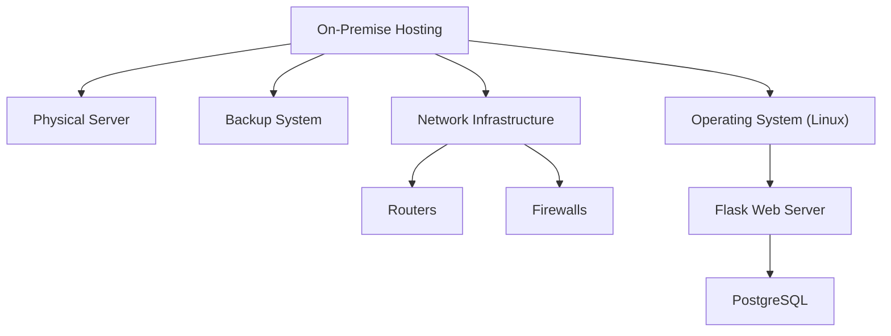
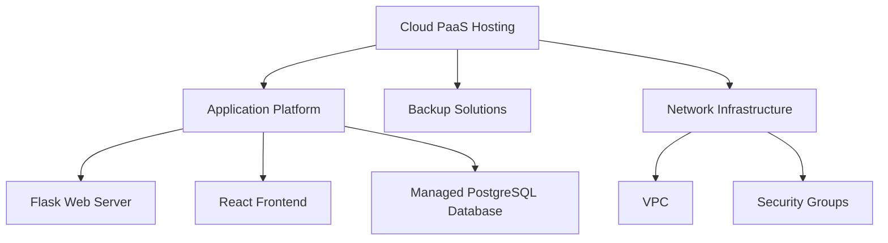

# On-Premises Architecture Overview



## Architecture Components
On-premise hosting of the program makes use of a physical server running Linux that also handles a number of software components. This configuration includes a network architecture with routers and firewalls to provide secure connection, as well as a backup system for data integrity and disaster recovery. The React frontend sends HTTP queries to the Flask web server, which then communicates with the PostgreSQL database to store all application data. Redis caching can be used as an optional layer to improve performance by lowering database load and accelerating data retrieval for frequently requested information.

 ## IaaS Architecture Overview

  ``` mermaid
    graph TD;
    A[Cloud IaaS Hosting] --> B[Virtual Machines]
    A --> C[Backup Solutions]
    A --> D[Network Infrastructure]
    D --> E[VPC]
    D --> F[Security Groups]
    D --> G[VNet]
    B --> H["Operating System (Linux)"]
    H --> I[Flask Web Server]
    H --> J[React Frontend]
    B --> K[PostgreSQL Database]
```
## How we shifted to Iaas:
The complete application had to be moved to the cloud in order to transition from on-premise hosting to IaaS. In order to easily increase resources, we took the actual server and transformed it into Virtual Machines (VMs) on the cloud. On these virtual machines (VMs), we installed the PostgreSQL database, Flask web server, React frontend, and Linux operating system. To ensure secure communication, a Virtual Private Cloud (VPC) was established, and security groups were added to manage access. In order to safeguard data, we also put backup plans into place. The team was able to concentrate on developing the program rather than worrying about hardware because of this change, which also made the application more manageable and versatile.

## Description of the architecture:
1. Cloud Infrastructure as a Service (IaaS): This model of hosting refers to the cloud infrastructure that hosts the complete application and offers on-demand resources such as networking, storage, and processing power. While the cloud provider oversees the management of the underlying physical resources, users retain authority over the virtualized hardware.
2. Virtual Machines (VMs): These are cloud-based virtualized instances that enable the deployment of different software environments. Based on the requirements of the application, each VM can be separately configured and scaled.
3. Network Infrastructure:Everything that makes it possible for resources in a cloud environment to communicate with one another is referred to as network infrastructure. It guarantees effective and safe data transit both inside and outside of the cloud.
4. VPC (Virtual Private Cloud):Virtual Private Clouds, or VPCs, let you create your own virtual network in a logically isolated area of the cloud. It permits management of subnets, routing, and IP address ranges.
5. VNet (Virtual Network):A VNet allows resource connectivity in a safe, isolated network environment, much like a VPC. It makes it possible to divide and organize resources more effectively.
6. Flask Web Server:This server runs business logic, processes HTTP requests from clients, and returns responses in addition to hosting the Flask application. It interfaces with the database and frontend as the application's backend.
7. Operating System (Linux):Operating system (Linux): Serving as the application's base, Linux controls hardware resources and offers a platform on which other software components can execute. Because of its performance, security, and stability, it is preferred.

## How we deployed the application in cloud using PaaS
Moving the application to a cloud platform that handles most of the underlying infrastructure management for us was part of the transition from on-premise hosting to PaaS. We relocated the PostgreSQL database, React frontend, and Flask web server to a PaaS environment, which manages scaling and deployment automatically. To protect data, backup methods were incorporated, and a Virtual Private Cloud (VPC) was set up for safe networking. Users that wish to restrict who can access the program can create security groups. This shift made administration easier, freeing the team to focus on creating and refining the product instead of troubleshooting hardware and infrastructure.
## Description of the architecture
1. Hosting for Cloud PaaS: This gives developers the opportunity to concentrate on coding instead of managing infrastructure by offering a controlled environment for application deployment.
2. Platform for Applications: Runtime environments, development tools, and services for application deployment are at the heart of the PaaS offering.
3. Infrastructure for Networks: This component consists of the networking elements that enable safe communication between cloud application resources.
4. Virtual Private Cloud, or VPC: This provides a rationally segregated environment for network configuration, improving security, and managing cloud resources.
5. Flask Web Server: Hosts the Flask application, processing HTTP requests and executing business logic, acting as the backend for the application.
6. PostgreSQL database management: It is a completely managed database service that takes care of upkeep, freeing developers to concentrate on creating applications rather than managing databases.


